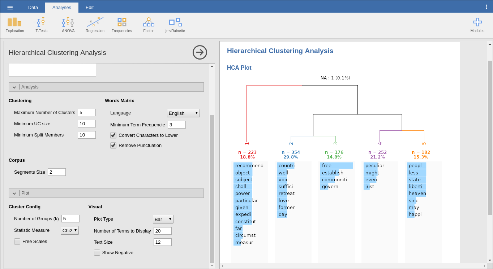

# jmvrainette
**EN**

A jamovi module which provides the hierarchical text clustering analysis from [rainette](https://github.com/juba/rainette) package.

It is possible to adjust the analysis parameters throughout the options in graphical interface.

The analysis results is plotted in a [dendrogram](https://en.wikipedia.org/wiki/Dendrogram), which also could be customized throughout interface.

Currently, the module only have the simple clustering analysis and supports portuguese and english idioms. Later, it will be added the double clustering available in rainette package.

**PT-BR**

Um módulo para jamovi que disponibiliza a análise de clusterização hierárquica de textos do pacote [rainette](https://github.com/juba/rainette).

É possível ajustar os parâmetros da análise através das opções na interface gráfica.

Os resultados da análise são plotados em um [dendrograma](https://pt.wikipedia.org/wiki/Dendrograma), que também pode ser personalizado através da interface.

Atualmente, o módulo contém apenas a análise de clusterização simples e suporta os idiomas português e inglês. Posteriormente, será adicionada a clusterização dupla disponível no pacote rainette.



# Installation
**EN**

In case you haven't installed jamovi, download it [here](https://jamovi.org/download.html). Next, download the [module](https://github.com/hgisaac/jmvrainette/releases). Go to module installation menu in the superior right corner. Click in "Sideload" tab, next in the load button and, finally, select the module file.

**PT-BR**

Caso você não tenha o jamovi instaldo, baixe-o [aqui](https://jamovi.org/download.html). Em seguida, baixe o [módulo](https://github.com/hgisaac/jmvrainette/releases). Vá até o menu de instalação de módulos no canto superior direito. Clique na aba "Sideload", depois no botão de carregamento e, por fim, selecione o arquivo do módulo.

## From source / A partir do código fonte
**EN**

First, clone this repository. Next, open the R terminal in repository folder, install the `jmvtools` package and install the module in jamovi application.

**PT-BR**

Primeiro, faça o clone deste repositório. Em seguida, abra o terminal do R na pasta do repositório, instale o pacote `jmvtools` e instale o módulo no aplicativo do jamovi.

```R
install.packages('jmvtools', repos=c('https://repo.jamovi.org', 'https://cran.r-project.org'))

jmvtools::instal()
```

# Credits
**EN**

This module wasn't be possible without the dedication of [Julien Barnier](https://github.com/juba) and contributors in re-implementing the original algorithms from [Iramuteq](http://iramuteq.org/) software. Thanks to your creator [Pierre Ratinaud](https://lerass.com/author/pratinaud).

Thanks to [Anderson da Silveira](http://lattes.cnpq.br/4555887087787481) for presenting me the Iramuteq and jamovi softwares, which helped in the development of my undergraduate thesis and motivated the creation of this module.

**PT-BR**

Este módulo não seria possível sem a dedicação de [Julien Barnier](https://github.com/juba) e colaboradores em reimplementar os algoritmos originais do software [Iramuteq](http://iramuteq.org/). Agradecimentos ao seu criador [Pierre Ratinaud](https://lerass.com/author/pratinaud).

Meus agradecimentos para [Anderson da Silveira](http://lattes.cnpq.br/4555887087787481) por ter me apresentado os softwares Iramuteq e jamovi, que auxiliaram no desenvolvimento do meu TCC e motivaram a criação deste módulo.
